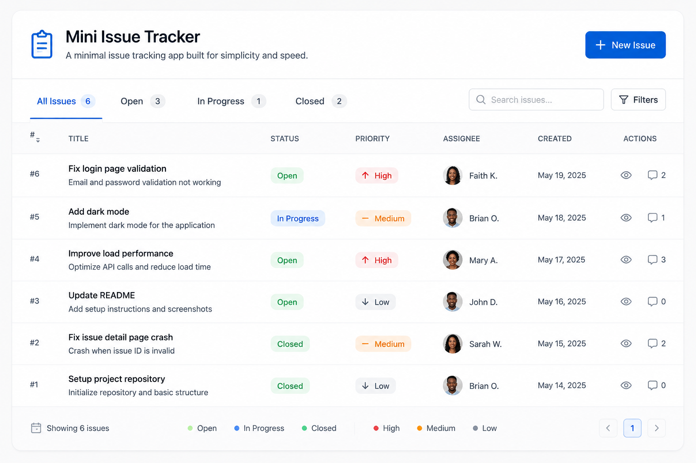

# Mini Issue Tracker


A secure, full-stack issue tracker where authenticated users can create and manage their own project issues. Built as a technical assessment for Hasafsec Cyber Solutions Ltd.

## Overview

Users can register, log in, and manage a personal list of issues (title, description, priority, status). All issue data is scoped per-user: authentication is required for every issue operation, and ownership is enforced on the server for every read, update, and delete — a user can never view or modify another user's issues, even by guessing or changing an issue ID.

## Tech Stack

- **Framework:** Next.js 14 (App Router) — combines the frontend (React) and backend (API routes) in a single project
- **Language:** TypeScript
- **Database:** PostgreSQL (hosted on [Neon](https://neon.tech))
- **ORM:** Prisma 5 — schema, migrations, and type-safe queries
- **Auth:** JWTs (signed with [`jose`](https://github.com/panva/jose), Edge-Runtime compatible) stored in an HttpOnly cookie
- **Password hashing:** bcryptjs
- **Validation:** Zod
- **Styling:** Tailwind CSS 3

## Getting Started

### Prerequisites
- Node.js 18+
- A PostgreSQL database (a free [Neon](https://neon.tech) project works well)

### 1. Clone and install
```bash
git clone <your-repo-url>
cd mini-issue-tracker
npm install
```

### 2. Configure environment variables
Copy the example file and fill in real values:
```bash
cp .env.example .env
```

| Variable | Description |
|---|---|
| `DATABASE_URL` | PostgreSQL connection string (from Neon or any Postgres instance) |
| `JWT_SECRET` | Long random string used to sign auth tokens. Generate with `openssl rand -base64 32` |

### 3. Set up the database
Run the Prisma migration to create the `users` and `issues` tables:
```bash
npx prisma migrate dev
```
This applies the schema in `prisma/schema.prisma` and generates the Prisma Client.

### 4. Run the app
```bash
npm run dev
```
Visit `http://localhost:3000`.

### Other useful commands
```bash
npm run build          # production build
npm start               # run the production build
npx prisma studio       # visual database browser
npx prisma migrate dev  # apply schema changes / create new migrations
```

## Database Schema

Two tables, related by a foreign key:

**users**
| Column | Type | Notes |
|---|---|---|
| id | uuid | primary key |
| name | string | |
| email | string | unique |
| passwordHash | string | bcrypt hash, never the raw password |
| createdAt | datetime | |

**issues**
| Column | Type | Notes |
|---|---|---|
| id | uuid | primary key |
| userId | uuid | foreign key → users.id, cascade delete |
| title | string | required |
| description | string | required |
| priority | enum | LOW / MEDIUM / HIGH |
| status | enum | OPEN / IN_PROGRESS / RESOLVED |
| createdAt | datetime | |
| updatedAt | datetime | |

Migrations live in `prisma/migrations/` and are applied automatically by `npx prisma migrate dev`.

## API Reference

All endpoints return JSON. Protected endpoints require a valid `token` cookie (set automatically on login).

| Method | Endpoint | Auth required | Description |
|---|---|---|---|
| POST | `/api/auth/register` | No | Create a new account |
| POST | `/api/auth/login` | No | Log in, sets auth cookie |
| POST | `/api/auth/logout` | No | Clears the auth cookie |
| GET | `/api/issues` | Yes | List the logged-in user's issues |
| POST | `/api/issues` | Yes | Create a new issue |
| GET | `/api/issues/:id` | Yes | View a single issue (must be owned by the requester) |
| PATCH | `/api/issues/:id` | Yes | Update an issue (must be owned by the requester) |
| DELETE | `/api/issues/:id` | Yes | Delete an issue (must be owned by the requester) |

**Register**
```
POST /api/auth/register
Body: { "name": "string", "email": "string", "password": "string (min 8 chars)" }
201 → { "user": { "id", "name", "email", "createdAt" } }
400 → invalid input
409 → email already registered
```

**Login**
```
POST /api/auth/login
Body: { "email": "string", "password": "string" }
200 → { "user": { "id", "name", "email" } }, sets HttpOnly cookie
401 → invalid credentials
```

**Create issue**
```
POST /api/issues
Body: { "title": "string", "description": "string", "priority": "LOW|MEDIUM|HIGH" (optional), "status": "OPEN|IN_PROGRESS|RESOLVED" (optional) }
201 → { "issue": {...} }
401 → not logged in
400 → invalid input
```

**Update issue**
```
PATCH /api/issues/:id
Body: any subset of { title, description, priority, status }
200 → { "issue": {...} }
404 → issue does not exist, or is not owned by the requester
```

## Security Decisions

**Authentication.** Passwords are hashed with bcrypt (10 salt rounds) before storage — the raw password is never persisted or logged. On login, a JWT containing `{ userId, email }` is signed and stored in an **HttpOnly, SameSite=Lax** cookie, not `localStorage` — this means the token cannot be read or exfiltrated via injected JavaScript (XSS), and the SameSite attribute mitigates CSRF. Logout clears the cookie by expiring it immediately.

**Authorization.** Every issue endpoint independently re-checks two things on the server: (1) is there a valid, unexpired session, and (2) does the issue's `userId` match the requester's `userId`. This check happens on every single request — there's no cached "trust" from a previous request. When an issue exists but belongs to someone else, the API returns `404 Not Found` rather than `403 Forbidden`, deliberately avoiding confirmation of which issue IDs exist to a user who doesn't own them.

**Validation.** All input is validated with Zod schemas at the API layer — required fields, email format, string length limits, and enum whitelisting for `priority`/`status` (rejecting anything outside `LOW/MEDIUM/HIGH` or `OPEN/IN_PROGRESS/RESOLVED`). This is backed by a second layer at the database level: Postgres enum types and a `UNIQUE` constraint on `email`, so even a bug in application-level validation can't produce invalid data.

**Route protection.** Next.js middleware checks for a valid session before rendering `/issues` pages, redirecting unauthenticated visitors to `/login` before any page content loads. This is a UX layer, not the security boundary — the actual enforcement lives in the API routes themselves, which remain protected regardless of what the frontend does.

**Error handling.** All API routes wrap their logic in try/catch; unexpected errors are logged server-side (`console.error`) but only a generic, safe message is returned to the client. No stack traces or database error details are ever exposed in a response.

**Secrets.** `.env` (containing the real `DATABASE_URL` and `JWT_SECRET`) is gitignored and never committed. `.env.example` documents the required variables with placeholder values only.

**Known trade-off.** Since sessions are stateless JWTs (not tracked server-side), logging out clears the cookie client-side but cannot invalidate a token that was already extracted elsewhere before expiry. This is an accepted limitation for this project's scope — a production system might add a server-side token blocklist or move to shorter-lived tokens with refresh rotation.

## Project Structure
```
app/
├── api/
│   ├── auth/{register,login,logout}/route.ts
│   └── issues/route.ts, issues/[id]/route.ts
├── login/page.tsx
├── register/page.tsx
├── issues/page.tsx, issues/new/page.tsx, issues/[id]/page.tsx
└── layout.tsx, page.tsx, globals.css
lib/
├── prisma.ts        — shared database client
├── auth.ts           — password hashing + JWT sign/verify
├── getCurrentUser.ts — extracts authenticated user from request
└── api.ts            — frontend fetch helper
prisma/
├── schema.prisma
└── migrations/
middleware.ts         — route-level auth redirect
```
